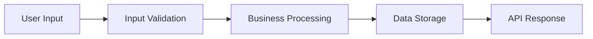

# Analysis Command

This command analyzes a codebase directory structure and provides insights about file roles and architecture.

## Usage

```
/analysis:${DIRECTORY_PATH}
```

## Examples

- `/analysis:src` - Analyze the src directory
- `/analysis:new_common_auth/src` - Analyze the new_common_auth/src directory
- `/analysis:.` - Analyze the entire project root

## Command Implementation

When this command is executed, perform the following analysis:

1. **Directory Structure Analysis**
   - Map out the complete directory hierarchy
   - Identify main architectural layers (API, services, models, etc.)
   - Categorize directories by their purpose

2. **File Role Identification**
   - Analyze each file's purpose based on naming conventions and location
   - Identify configuration files, main entry points, and utility modules
   - Detect framework-specific patterns (FastAPI, SQLAlchemy, etc.)

3. **Architecture Overview**
   - Identify the overall architecture pattern (MVC, layered, microservices, etc.)
   - Map dependencies between modules
   - Highlight key integration points

4. **Code Quality Insights**
   - Identify potential code organization issues
   - Suggest architectural improvements
   - Note any missing common patterns or files

## Analysis Output Format

Provide a structured analysis in the following format:

### 📁 Directory Structure
- High-level directory overview with purposes

### 🔍 File Roles by Category
- **API Layer**: Controllers, routes, endpoints
- **Business Logic**: Services, domain logic
- **Data Layer**: Models, repositories, database configs
- **Infrastructure**: Caching, external integrations
- **Configuration**: Settings, environment configs
- **Testing**: Test files and configurations
- **Utilities**: Helper functions and shared code

### 🏗️ Architecture Analysis
- Architecture pattern identification
- Component relationships
- Data flow patterns

### 📊 Architecture Diagrams

Generate Mermaid diagrams to visualize the architecture:

#### 1. Directory Structure Diagram


#### 2. Component Architecture Diagram


#### 3. Data Flow Diagram (if applicable)


### 💡 Recommendations
- Organizational improvements
- Missing components
- Best practice suggestions

## Implementation Instructions

1. Use the LS tool to get the directory structure of the specified path
2. Use the Glob tool to find files by patterns (*.py, *.js, *.ts, etc.)
3. Use the Read tool to examine key files for understanding their roles
4. Use the Grep tool to search for specific patterns that indicate file purposes
5. Analyze the findings and present them in the structured format above
6. **Generate Mermaid diagrams** based on the analysis:
   - Create directory structure diagrams showing hierarchy and categorization
   - Generate component architecture diagrams showing layer relationships
   - Include data flow diagrams for complex systems
   - Use appropriate color coding and styling for different layers

### Diagram Guidelines

**Color Schemes:**
- API Layer: Light blue (`#e1f5fe`, `#01579b`)
- Business/Service Layer: Light purple (`#f3e5f5`, `#4a148c`)
- Data Layer: Light green (`#e8f5e8`, `#1b5e20`)
- Configuration: Light orange (`#fff3e0`, `#e65100`)
- Infrastructure: Light gray (`#f5f5f5`, `#424242`)
- Testing: Light yellow (`#fffde7`, `#f57f17`)

**Diagram Types to Include:**
1. **Directory Structure** - Tree view of project organization
2. **Component Architecture** - Layered architecture with dependencies
3. **Data Flow** - How data moves through the system
4. **Infrastructure** - For IaC projects, show AWS/cloud resources
5. **Service Dependencies** - For microservices architectures

Focus on providing actionable insights about the codebase organization and suggesting improvements where appropriate.
